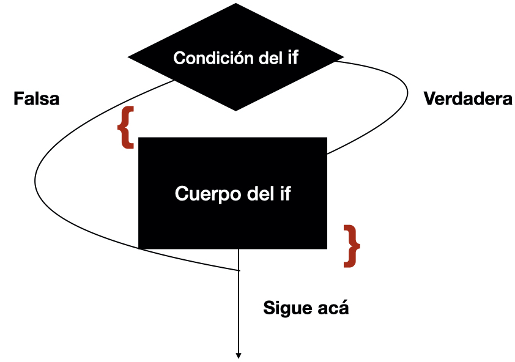
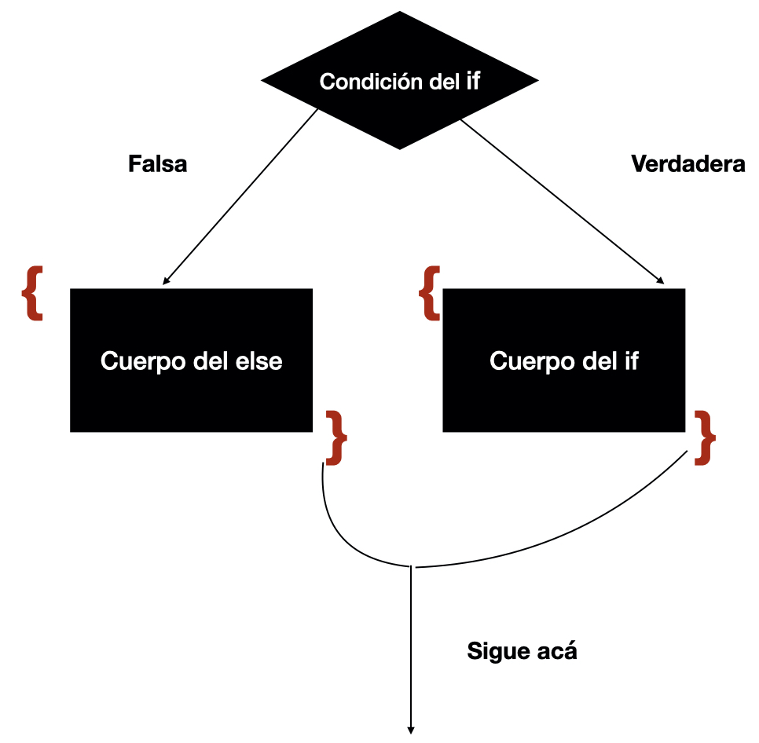
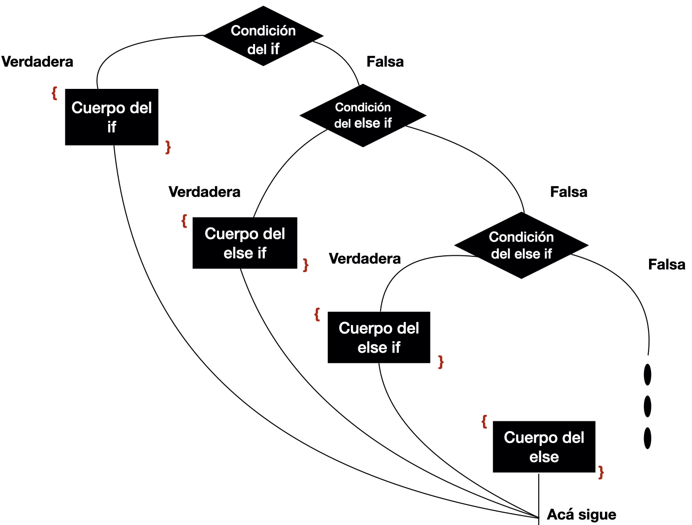

---
output:
  word_document: default
  html_document: default
---
# Estructuras de selección {#Estructuras_de_seleccion}

1.  `if`
2.  `if` ... `else`
3.  `ifelse`
4.  `if ... else if ...else if ...else`

## If (si condicional)

La instrucción `if` nos permite probar una condición y esa condición debe arrojar un valor booleano, es decir, un valor de verdad (`TRUE` o `FALSE`) Si la condición es verdadera se ejecuta lo que está dentro de los corchetes, de lo contrario, ejecuta lo que sigue después del corchete de cierre.

**Definición**: Lo que se encuentra dentra del corchete se llama cuerpo ( *body* ) de la declaración `if`

{#id .class width=50% height=50%}

La sintáxis de una condición `if` consiste en lo siguiente:

`if (condicion){`

`si la condicion es verdadera`

`Ejecuta TODO lo que está en los corchetes`

`}`

### Sintaxis

``` {.R}
if(<condition>) {
        ## Hace algo
} 
## Continúa con el resto del código
```

### Errores comunes en el `if`

1.  No incializar la variable de la condición.
2.  La condición no arroja un valor de verdad.
3.  No poner todo lo que quieres que haga **dentro** de los corchetes.
4.  Este no es un error, es más bien una advertencia, si la condición arroja un sólo valor de verdad sólo toma en cuenta el primero de ellos.

###Ejemplos de uso del `if`

```{r}

mayor_de_edad<-18

edad<-20

if(edad >=mayor_de_edad){
  print("Eres mayor de edad")
}
x<-5+4
print(x)
```

```{r}
minimo<-20000
dinero<-15000

if(dinero>=minimo){
  print("¿Cómo está Cancún?")
  print("La vida es buena")
  sobrante<-dinero-minimo
  print(paste("Me queda $", sobrante))
}
print("Acá sigue")
```

#### Ejercicios

1.  Elabora un programa que compare tu estatura con tu ídolx y determine si eres más altx.
2.  Toma dos archivos fasta de virus distintos. Leelos con Biostrings y compara sus tamaños ( en bp) y determina si el primero es más grande que el segundo.
3.  A partir del archivo de anotación del genoma de un organismo determina toma dos proteínas al azar y compara sus tamaños. Toma todos los genes de la cadena positiva y todos los de la negativa compara sus tamaños promedio y determina cuál de estos es más grande.

------------------------------------------------------------------------

## Combinación de operadores booleanos

Los operadores lógicos o booleanos se pueden combinar para formar enunciados complejos por ejemplo:

1.  Tengo vacaciones (del trabajo y/o la escuela)
2.  Tengo dinero

Si las dos condiciones son ciertas entonces puedo hacer algo

También podría ser que basta con que una de ellas sea cierta para que haga algo.

### And (&)

El operador booleano `&` representa el y lógico. Estos operadores binarios nos sirven para unir al menos dos enunciados que tienen valor de verdadero o falso (Tengo dinero (V/F), Tengo vacaciones (V/F))

Con estas dos operaciones puedo unirlas utilizando el operador `y` lógico (AND (`&`) representado en R con el símbolo del ampersand (`&`)

Tengo dinero AND Tengo vaciones

Para saber el valor booleano (V/F) del enunciado anterior debemos concocer los valores de verdad de los enunciados por separado

Por ejemplo, podemos representar al primer enunciado por `p` y al segundo enunciado por `q`

`p: Tengo dinero`

`q: Tengo vacaciones`

Para saber cuál es el valor de verdad del enunciado compuesto debemos ver cuáles son todas las combinaciones de valores de verdad de los enunciados que la componen: p verdadero y q verdadero, p falso y q verdadero, p falso y q verdadero, p falso y q falso. Eso se resumen en las tablas de verdad de los operadores

|  p  |  q  | p & q |
|:---:|:---:|:-----:|
|  V  |  V  |   V   |
|  V  |  F  |   F   |
|  F  |  V  |   F   |
|  F  |  F  |   F   |

: Tabla de verdad del AND

Es decir, el `&` solo es **verdadero** cuando ambas condciones son **verdaderas**.

Esto representa lo que se observa en la realidad: es decir, solo hago algo si tengo y tengo vacaciones. Si una de ellas no se cumple (es decir, es falsa) entonces no se lleva a cabo la acción.

### OR (\|)

El operador booleano `|` representa el `o` lógico. Estos operadores binarios nos sirven para unir al menos dos enunciados que tienen valor de verdadero o falso (Tengo dinero (V/F), Tengo vacaciones (V/F))

Con estas dos operaciones puedo unirlas utilizando el operador `y` lógico (OR (`|`) representado en R con el símbolo de *la barrita* (`|`)

Tengo dinero OR Tengo vaciones

Para saber el valor booleano (V/F) del enunciado anterior debemos concocer los valores de verdad de los enunciados por separado

Por ejmplo podemos representar al primer enunciado por `p` y al segundo enunciado por `q`

`p: Tengo dinero`

`q: Tengo vacaciones`

Para saber cuál es el valor de verdad del enunciado compuesto debemos ver cuáles son todas las combinaciones de valores de verdad de los enunciados que la componen: p verdadero y q verdadero, p falso y q verdadero, p falso y q verdadero, p falso y q falso. Eso se resumen en las tablas de verdad de los operadores

|  p  |  q  | p \| q |
|:---:|:---:|:------:|
|  V  |  V  |   V    |
|  V  |  F  |   V    |
|  F  |  V  |   V    |
|  F  |  F  |   F    |

: Tabla de verdad del operador OR

Es decir haría algo, por ejemplo, irme a la playa cuando **al menos** una condición se cumpla. Por ejemplo que tenga dinero aunque no tenga vacaciones, que tenga vacaciones aunque no tenga dinero y, obviamente, también cuando las dos se cumplen.

Es decir, el `|` solo es **falso** cuando ambas condiciones son **falsas**.

### Ejemplos de combinaciones

Por eejmplo es útil para intervalos

$$
18 \leq edad \leq 29 
$$

Esta condición la podemos expresar mediante la combinación de dos: la edad debe ser mayor igual a 18 y (**AND**, `&`) la edad debe ser menor o igual que 29

```{r}

if (edad >= 18 & edad <=29){
  print("Te toca vacunarte")
}

```

**Pregunta**: ¿qué pasaría si se pone un **OR** como unión entre las dos condiciones

```{r}
if (edad >= 18 | edad <=29){
  print("Te toca vacunarte")
}


```

o así (¿es lo mismo?)

```{r}
if (edad <= 29 | edad >= 18){
  print("Te toca vacunarte")
}


```

## Ejercicio

1.  ¿Cómo harías una condición que considere que te gusta el mole y el pozole?

2.  ¿Cómo harías una condición que considere que te gusta el mole o el pozole?

## If ... else (si ... de otro modo)

Si además quieres que se ejecute algo cuando la condición es **falsa** entonces debes usar la declaración `if … else`

``` {.R}
if (condición) { # Si la condición es cierta
hace esto
y esto
y esto
} else { # De otro modo, es decir si es falsa hace lo que #está en el corchete
entonces hace esto otro
y esto otro
y esto
}
```

{#id .class width=50% height=50%}

```{r}
minimo<-20000
vacaciones<-"SI"
dinero<-21000
if(dinero>=minimo & vacaciones=="SI"){
  print("Me voy a la playa, looser")
}else{
  print("Me quedo en mi casa")
}

```

## ifelse

Si la condición es muy simple ,tanto para cuando es verdadero como cuando es falso se puede implementar la función `ifelse` en una línea. Es equivalente a la condición compuesta pero ahorramos código.

```{r}
edad<-21
ifelse(edad>=18, "Ya eres grande","Todavia no puedes beber (legalmente)")

edad<-12
ifelse(edad>=18, "Ya eres grande","Todavia no puedes beber (legalmente)")


```

## If ... else if ... else ( si, si no si , si no si, si no)

Si tienes más opciones, es decir no alternativas, puedes usar la sentencia `if … else if …else if …else`

Importante

:   Esta estructura se ejecuta solo en la primera que sea verdadera o si no hay una verdadera ejecuta lo que esta en el `else`

``` {.R}
if ( condicion 1) {
Hace cosas
} else if ( condcion 2) {
Hace otras cosas
} else if ( condicion 3) {
Hace estas otras cosas
} else {
No le queda de otra y hace esto
}
```

{#id .class width=50% height=50%}
```{r}
numero<-3
if(numero > 0){
  print("Tu número es positivo")
}else if (numero <0){
  print("Tu número es negativo")
}else{
  print("Tu número es cero")
}


numero<- -27
if(numero > 0){
  print("Tu número es positivo")
}else if (numero <0){
  print("Tu número es negativo")
}else{
  print("Tu número es cero")
}


numero<- 0
if(numero > 0){
  print("Tu número es positivo")
}else if (numero <0){
  print("Tu número es negativo")
}else{
  print("Tu número es cero")
}

```

**Pregunta**: ¿por qué no es necesario poner un if en el último else?

## Ejercicios

1.  Elabora un programa que con tu fecha de cumpleaños te diga en qué estación del año naciste.

2.  Elabora un porgrama que a partir de las calficaciones de tus examenes parciales y 8 quincenales arroje si exentaras o no este curso usando los criterios definidos en el programa del curso. Asume que en las tareas y demás actividades tienes 10.
