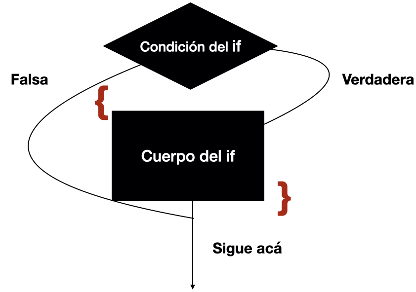
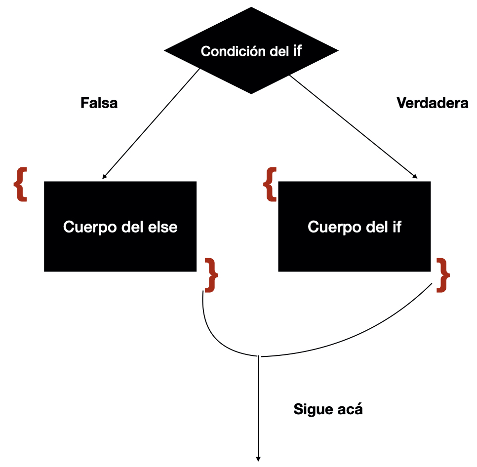

# Acá empieza


<!--chapter:end:index.Rmd-->

# Introducción a R {#intro}
R es un entorno integrado para el manejo de datos, el cálculo, la generación de gráficos y análisis estadísticos. Las principales ventajas del uso de R son:

1. Software libre.
2. Facilidad para el manejo y almacenamiento de datos.
3. Un conjunto de operadores para el cálculo de vectores y matrices.
4. Una colección extensa e integrada de herramientas intermedias para el análisis estadístico de datos.
5. Multitud de facilidades gráficas de altísima calidad
6. Un lenguaje de programación (muy) poderoso con muchas libreráis especializadas disponibles.
7. La mejor herramienta para trabajar con datos genómicos, proteomicos, redes, metabolómica, entre varias más.
8. **Casi todos podemos aprender por nuestra cuenta a usar excel (pero hay que pagar...), sin embargo es más  díficil aprender por nuestra cuenta R; y si lo hacemos nos da una ventaja sobre el resto.**

## Paquetes o bibliotecas

Las funciones especializadas de R se guardan en paquetes *(packages)* que deben ser invocados ANTES de  llamar a una función del paquete


Una manera de instalar paquetes es mediante el repositorio [CRAN](https://cran.r-project.org/). 

Navega por CRAN y encuentra algunos paquetes que podrían interesarte. Hay miles y cada día aumentan.

Para saber qué paquetes se tienen instalados en
tu máquina teclea la función library()

```{r}
library()
```


Para cargar un paquete en particular deben teclear, siempre y cuando ya esté instalado

`library(nombre_de_paquete)`

Por ejemplo
```{r}
library(gplots)  
```

Para visualizar los paquetes ya cargados tecleamos

```{r}
search()
```

Para visualizar las funciones dentro de un paquete en particular se utiliza

```{r}
ls(2)
```

 

```{r}
demo(graphics)
```
## Ayuda en R

help(nombre_comando) o ?nombre_comando

```{r}
help(solve)
```

```{r}
?solve
```

son equivalentes para buscar ayuda sobre el comando solve

Para buscar ayuda de funciones o palabra reservadas se utilizan comillas

```{r}
help("for")
```

Para abrir la ayuda genral en un navegador (sólo si tenemos la ayuda en HTML instalada y tenemos conexión a la red) se utiliza

```{r}
help.start()
```

```{r}
help.search("clustering")
```

Si queremos ver ejemplos del uso de los comandos usamos la función ejemplo


```{r}
example("hclust")
```

 Todo lo anterior requiere que conzocamos el nombre correcto del comando, pero ¿qué pasa si no lo sabemos?
 Podemos utilizar el comando `apropos()` para encontrar todo lo relacionado con algún término
 
 
 
```{r}
apropos("solve")
```

## Expresiones y asignaciones

Hay dos tipos de resultados en R: expresiones y asignaciones. Las primeras sólo se muestran a la salida estándar y NO se guardan en una variables; las segundas se asignan y guardan en una variable

```{r}
rnorm(10)
```

```{r}
x <- rnorm(10)
```


```{r}
x
```


R distingue entre mayúsculas y minúsculas, así las siguientes variables contienen valores distintos

```{r}
a <- 3
```


```{r}
A <- 6
```

Los comandos pueden separarse por `;` o - mejor opción- por un salto de línea

```{r}
a <- 3; b <-5
```
 también pueden definirse asignaciones en más de una línea
 
```{r}
a <-
  pi + 12
```


## Movimiento entre directorios


Para saber en qué directorio estamos tecleamos 

```{r}
getwd()
```

Para cambiar de directorio utilizamos `setwd("direccion_a_la_que_quieres_ir")` 

                              
```{r}
setwd("~")
```

También podemos usar los comandos de bash dentro de R, utilizando la función `system()`

```{r}
system("ls -la")
```


```{r}
system("pwd")
```

## Importante

**Como regla general todos los nombres van entre comillas: nombre de carpetas, archivos, de columnas, de renglones,etc.**


## Operaciones aritméticas

Se puede sumar, restar, multiplicar,dividir, "exponenciar" y calcular la raíz cuadrada.
Los operadores son, respectivamente: `+`,`-`,`*`, `/`,`**` o `^`, `sqrt()`

```{r}
a + b
```

```{r}
a - b
```

```{r}
a * b
```


```{r}
a ** b
```


```{r}
a ^ b
```


```{r}
sqrt(a)
```

## Prioridad en las operaciones

Las operaciones se efectuan en el siguiente orden:

1. izquierda a derecha
2. sqrt() y ** , ^
3. "*" y /
4. "+" y -
5. <-

Este orden se altera si se presenta un paréntesis. En ese caso la operación dentro del paréntesis es la que se realiza primero.

Ejemplos

4 + 2 *3 = 4 + 6 = 10

4-15/3 +3^2 +sqrt(9)= 4-15/3 + 9 +3 = 4-5+12=13

4-(3+7)^2 + (2+3)/5=4-100+5/5=-95


### Ejercicios

Resuelve en un pedazo de papel primero para saber cuál sería el resultado de las siguientes operaciones aritméticas. Después comprueba tu resultado tecleandolas en R


1. 1 + 2*3 +3 +15/3
2. 4-15/3 +3^2 +3*sqrt(81)
3. 40-(4+3)^2 + (10-5)/3


## Tipos de datos lógicos o booleanos

Estos tipos de datos **sólo** contienen información `TRUE` o `FALSE`. Sirven para evaluar expresiones de =, <, > y pueden utilizarse para obtener los elementos de un vector que cumplan con la característica deseada.


```{r}
1 < 5
10 == 0  # Es igual a
10 != 0    # NO es igual a
10 <= 0    #Menor o igual 
```

Dentro de R un valor lógico `TRUE` equivale a 1 y `FALSE` equivale a 0, por lo tanto para contar cuántos `TRUE`s hay podemos hacer una suma:


**Ejercicio** utiliza una sola líndea de R para averiguar si el logaritmo base de 10 de 20 es menor que la raiz cuadrada de 4.

### Caracter

Son *strings* de texto. Se distingue porque los elementos van entre comillas (cada uno). Puede ser desde un sólo caracter hasta oraciones completas. Puede parecer que contienen números, pero las comillaa indican que serán tratados como texto. Podemos subsetearlos por su índice o buscando literalmente el texto.


```{r}
x<- "La candente mañana de febrero en que Beatriz Viterbo murió, después de una imperiosa agonía que no se rebajó un solo instante ni al sentimentalismo ni al miedo"
```


### Enteros y números (numeric)

R por default representa los números como `numeric`, NO `integer`. Estos tipos son dos formas diferentes en las cuales las computadoras pueden guardar los números y hacer operaciones matemáticas con ellos. Por lo común esto no importa, pero puede ser relevante para algunas funciones de Bioconductor, por ejemplo ya que el tamaño máximo de un `integer` en R es ligeramente más chico que el tamaño del genoma humano. 


¿Cómo revisar si un objeto es numeric o entero?

```{r}
x <- 1
class(x)
x <- 1:3
class(x)
```

<!--chapter:end:01-Intro.Rmd-->

# Vectores en R {#vectors}
---
En R puedes guardar muchos elementos del mismo tipo en un sólo objeto mediante vectores.

Un vector es una colección de datos del mismo tipo. Siempre del **mismo tipo**. No es posible mezclarlos.

-----

# Vectores

## Definición

Para definir un vector se utiliza la función c(), que siginfica *combine* 


```{r}
x <- c(1,2,6,90,76.7)
```

### Longitud de un vector

Para obtener la longitud de un vector, es decir el número de elementos que tiene
se utiliza la función `length()`

```{r}
length(x)
```

Como siempre, para mostrar el contenido de una variable
sólo es necesario poner la variable y presionar enter en la sesión interactiva, si se está en un *script* es necesario usar la función `print()`

## Uso de la función combine `c()` y el operador `:`
Un vector se puede definir de forma extensiva, es decir poniendo explícitamente todos los valores del vector.

```{r}
y<-c("esto","es","un","vector")
z<-c(1,10,100,1000)
```

Esto es muy poco eficiente a menos que los vectores sean muy pequeños por lo que existen funciones para generar algunos casos particulares.
Por ejemplo, si queremos tener un vector que tenga los primeros 100 números enteros podemos definirlo de la siguiente manera con el uso del operador `:` :

```{r}
x<-1:100;
x
```
También se puede usar de forma equivalente la función `seq()` que significa sequence. `seq()` es una generalización del operador `:`,
```{r}
x<-seq(1,100)
x
```

con ella podemos generar secuencias numéricas de distintas clase y espaciadas por diferentes rangos. Por  ejemplo si queremos tener una secuencia de -12 a 30 en pasos de 3, es decir -12, -9,-6,..., 27,30
Teclearíamos 

```{r}
x<-seq(from=-12,to=30,by=3)
x
```
Podemos omitir los nombres from, to,by si usamos el mismo orden, si queremos intercambiarlo debemos necesariamente ponerlos

```{r}
y<-seq(0,1,0.1)
y
```


```{r}
z<-seq(by=0.1, to =1, from=0.5)
z
```

## Acceder a elementos de un vector

### Elementos consecutivos de un vector

Para acceder a elemetnos de un objeto con índices en R debemos usar los
corchetes `[]` para indicarle que queremos seleccionar esos objetos

```{r}
x<-c("Muchos", "años" ,"después" ,",", "frente", "al" ,"pelotón")
x[1:4]
```

`

```{r}
x<-c(1,2,3,5,8,13,21)
x[3:6]
```


### Elementos no consecutivos de un vector


Para seleccionar elementos no consecutivos definimos un nuevo vector (con la función `c()` ) de  índices que seleccionará los elementos que quieres

```{r}
x<-c("Muchos", "años" ,"después" ,",", "frente", "al" ,"pelotón")
x[c(1,3,5,7)]
```

No es necesario que estén  en orden


```{r}
x<-c(1,2,3,5,8,13,21)
x[c(2, 7, 4)]
```


### Excluir elementos de un vector

Para seleccionar algunos elementos **excepto** un conjunto de ellos usamos
el signo menos `-`


```{r}
x<-c(1,2,3,5,8,13,21)
x[-2]
```


```{r}
# Todos menos el segundo elemento
x[-c(2, 7, 4)]   # Todos menos el segundo , séptimo y cuarto elemento
x[-length(x)]    # ¿Esto qué hace?
```

Este comando **no elimina** elementos de un vector sólo los selecciona

```{r}
x<-c(1,2,3,5,8,13,21)
x[-6] 
x     # Estoy intacto
```


## Agregar y quitar elementos de un vector

```{r}
x <- c(88,5,12,13)
x <- c(x[1:3],168,x[4]) 
x
```

Podemos, incluso, definir un vector vacío y luego "llenarlo"

```{r}
x<-c()
x                 # Soy un vector vacío :(
x[1]<- 2
x[2:5]<-c(56,78,90,12)
x                 # Ahora ya no :)
```

## Repetición de elementos de un vector con `rep()`

La función `rep()`  que viene del inglés *repeat* nos permite repetir elementos en un vector dado. Por ejemplo, `rep(x,n veces)`


```{r}
x<-rep(3,5)
x
y<-rep(c(1,2,3,5),3)
y
```

```{r}
primos<-c(1,2,3,5,7,11)
z<-rep(primos,4)
z
```

También podemos usar la opción `each` para indicar la frecuencia de repetición

```{r}
x<-c(1,2,3,4)
y<-rep(x,each=2)
y
```


## Uso de funciones `any()` y `all()`

Las funciones `any()` y `all()` determinan si alguno o todos los elementos de un vector cumplen cierta condición respectivamente. La respuesta siempre será un valor booleano es decir: **TRUE** o **FALSE**


```{r}
x<- 1:15
any(x > 7.5)
```

```{r}
any(x > 19.76)
any(x >= 15)
```


```{r}
all(x> sqrt(100))
```

```{r}
all(x>0)
```
## Operaciones con vectores

Al igual que en álgebra podemos definir varias operaciones que nos dejan siempre otro vector:

1. Suma (resta) de vectores
2. Producto de vectores (término a término)
3. Producto de un escalar por un vector


```{r}
x<-c(1,2,3)
y<-c(4,5,6)
x + y 
x-y
x*x
y*y
x*y
3*x                #Multiplicación por escalar: término a término
sqrt(2)*y          # Sí, por cualquier escalar!
3*x + sqrt(2)*y    # Operaciones más complejas
```
 
También podemos aplicar funciones para calcular con una sola instrucción varias operaciones útiles, por ejemplo `min()`, `max()`, `range()` , 
 `sum()`, `mean()`, `median()`, `sd()`,`quantile()`,`unique()`,`sort()`
 Si tienes duda de qué hace alguna de ellas busca en la ayuda
 
```{r}
x<-rnorm(1000)
min(x)
max(x)
range(x)
sum(x)
mean(x)
median(x)
sd(x)
quantile(x)
```
 
 Para `unique()` y `sort()` conviene tener elementos discretos más que continuos
 
```{r}
x<- c(rep(3,5),1:15,rep(c(1,2,3),5))
unique(x)
```
 
 
```{r}
x<-sample(10,10)
x
sort(x)
```
 
## Gráficos con vectores

Podemos graficar los vectores de manera inmediata en `R`

```{r}
x<- rnorm(10000)
hist(x,col="tomato2")
plot(x,col="salmon")
boxplot(x,col="wheat")
```


## Vectores con nombre

Definimos un vector llamado edades 
```{r}
edades<-c(35,35,70,17,14)
edades
```

Podemos definir un vector del mismo tamaño que `edades` llamado nombres

```{r}
nombres <-c("Jerry","Beth","Rick", "Summer","Morty")
nombres
```

Una de las cracterísticas de R es que podemos asignarles nombres a los vectores, para ello usamos la función `names()`


```{r}
names(edades)<-nombres
```

Con ello ahora el vector edades tiene una nueva característica:

```{r}
edades
```

Podemos selecccionar de la manera usual, por ejemplo, si quiero ver cuál es la edad de Rick, debo seleccionar el 3 elemento

```{r}
edades[3]
```

Esto es  muy poco eficiente y propenso al error sobre todo con vectores muy grandes. Por ello podemos usar los nombres de los vectores 

```{r}
edades["Rick"]
```


**Recuerda que los nombres S-I-E-M-P-R-E van entre comillas**

```{r}
edades[c("Rick","Morty")]
```


**Ejercicios:**

1. ¿Cuál es el promedio de las edades, sin contar el de Beth?
2. Quiten a Morty del vector, ordénenlo y guárdenlo como un nuevo objeto.
3. ¿Hay alguna edad que sea mayor de 75? ¿Menor de 12? ¿Entre 12 y 20?


### Tamaños de genomas 

Ahora veamos un ejemplo más "biológico"


```{r}
genomeSizeM_BP<-c(3234.83,2716.97,143.73,0.014281,12.1)
```

Por ejemplo si quisierámos ver el tamño en bp simplemente multiplicamos por el valor del prefijo Mega = 1 millón

```{r}
genomeSizeM_BP*1e6
```


```{r}
organismo<-c("Human","Mouse","Fruit Fly","Roundworm","Yeast")
```


```{r}
names(genomeSizeM_BP) <- organismo
```


```{r}
genomeSizeM_BP
```


Se pueden seleccionar elementos de un vector utilizando corchetes 

```{r}
genomeSizeM_BP[1]
```


Para obtener elementos consecutivos 

```{r}
genomeSizeM_BP[1:4]
```

Para obtener elementos NO consecutivos

```{r}
genomeSizeM_BP[c(1,2,5)]
```


Para selecciona (no eliminar, ni quitar)  elementos excepto algunos


```{r}
genomeSizeM_BP[-c(1,3,5)]
```

Para referirnos a los elementos por su nombre

```{r}
genomeSizeM_BP[c("Yeast","Human")]
```

Además de algunas operaciones aritméticas, se pueden calcular la media, máximo, mediana, mínimo, suma y longitud de los vectores

**Ejercicio**

1. Generar un vector de las edades de 10 de tus compañeros 
2. Asignales nombre.
3. Encuentra el mínimo,máximo, media, mediana, la desviación estándar, la longitud del vector y selecciona sólo los elementos impares.
4. Elimina el máximo y el mínimo y con el vector resultante realiza un histograma.
5. Crea un vector de caracteres con diez nombres de especies y asocialo con su número de acceso de NCBI para su genoma en nucleótidos.

## ¿Cómo lidiar con las NAs ?

Es (muy) freceunte que en bases de datos se tengan valores `NA`, es decir medidas que no pudieron realizarse, medidas perdidas, etc. Para ello se utiliza `NA`. `R` trata de manera especial a las NAs

```{r}
x <- c(88,NA,12,168,13)
```
Existe una fución para determinar si un elemento es o no una `NA`. La función es `is.na()`


```{r}
x <- c(88,NA,12,168,13)
```


```{r}
is.na(x)
```

Si queremos calcular ciertas funciones numéricas `R` no sabrá qué hacer

```{r}
x <- c(88,NA,12,168,13)
mean(x)
```

Sin emabrgo, podemos decirle a `R` que las omita, indicando como argumento de la función `mean()` `na.rm=TRUE` que significa *na remove*


```{r}
x <- c(88,NA,12,168,13)
mean(x,na.rm=TRUE)

```

¿Qué otras funciones tienen esta opción?

## Filtrado de elementos de un vector

Podemos generar vectores de que sean subconjuntos de vectores más grandes que cumplan cierta(s) condición(es)

```{r}
un_vector<-c(1,2,3,5,7,11,13,17,19) 
otro_vector <- un_vector[un_vector*un_vector > 10]   # Leeme de adentro hacia afuera
otro_vector
```


Veamos paso a paso qué es lo que hace este proceso

```{r}
un_vector
un_vector*un_vector > 10    # Mira, de adentro hacia afuera
indices<-un_vector*un_vector > 10 
un_vector[indices]
un_vector[c(FALSE,FALSE,FALSE,TRUE,TRUE,TRUE,TRUE,TRUE,TRUE)]
```

la representación interna de los valores booleanos `FALSE` y `TRUE`son 0 y 1 respectivamente

```{r}
un_vector[c(rep(0,3),rep(1,1))]
```

### Filtrado con `subset()`

Podemos usar la función `subset()`para hacer lo mismo que en el caso anterior **excepto que omite los NA**


```{r}
un_vector<-c(1,2,3,5,7,11,13,17,19) 
otro_vector <- subset(un_vector,un_vector*un_vector > 10)   
otro_vector
```


Qué pasa si tenemos `NA`s. Si usamos el método anterior obtendríamos


```{r}
un_vector<-c(1,2,3,5,7,11,NA,13,17,NA,19) 
otro_vector <- un_vector[un_vector*un_vector > 10]   # Leeme de adentro hacia afuera
otro_vector  # Aquí salen las NAs
```


En cambio con `subset()`
```{r}
un_vector<-c(1,2,3,5,7,11,NA, 13,17,NA, 19) 
otro_vector <- subset(un_vector,un_vector*un_vector > 10)   
otro_vector  # Aquí ya no aparecen las NAs
```


### La función de selección `which()`

La función `which()` nos regresa los índices es decir nos dicen **quiénes** cumplen cierta condición


```{r}
z <- c(5,2,-3,8)
which(z*z > 8)

```

Acá nos dicen quiénes

```{r}
z[which(z*z > 8)]
```

## ¿Cómo podemos ver si dos vectores son iguales?

Dos vectores son iguales si elemento a elemento son idénticos.
Por lo tanto deben de ser del mismo tamaño. Para probar si dos elementos son iguales se utiliza el operador de comparación `==` son dos signos iguales juntos, sin espcaio. No confundir con el operador `=` que se puede usar como operador de asiganción (aunque no es recomendable su uso. De hecho está prohibido en este curso)

```{r}
x<-c(1,4,9,16,25)
y<-1:5
y<-y*y
```


```{r}
x==y
```

¿Qué pasaría si me confundo y escribo el operador de igualdad en lugar del de comparación?


```{r}
y <-5:9
y
```

```{r}
x=y
```


```{r}
x
y
```

Para vectores grandes puedo usar la función `all()` que ya vimos arriba


```{r}
x <- seq(1,10000,1)
y <- seq(1,10000,1)
all(x==y)
```
¿Cómo podríamos corrobar que son iguales usando `any`?

También podríamos utilizar que `TRUE` es `1` y que `FALSE`  es `0`

¿Por qué este código nos dice que sí son iguales?

```{r}
sum(x==y)
```


### Factor

Los factores son un tipo de vector que puede tomar un número "limitado" de valores, que normalmente se utilizan como variables categóricas. Por ejemplo: macho/hembra. Es útil tenener este tipo de objeto porque varios modelos estadísticos que se pueden correr en `R` los utilizan. A los valores que pueden tomar los elementos del factor se les conoce como *levels*.


```{r}
x<- c(1,2,2,3,1,2,3,3,1,2,3,3,1)
x
as.factor(x)
x<-as.factor(x)
x
```


Los factores son una manera computacionalmente eficiente de almacenar caracteres, pues cada valor único (level) se guarda solo una vez y a los datos se les asigna un valor entero. 

```{r}
meses = c("March","April","January","November","January",
       "September","October","September","November","August",
        "January","November","November","February","May","August",
        "July","December","August","August","September","November",
         "February","April")
meses
meses<-as.factor(meses)
meses
```


El que existan los levels permite realizar ciertas operaciones y manipular el contenido del factor.

```{r}
table(meses)
levels(meses)
levels(meses)[1]
levels(meses)[1]<-"Abril"
levels(meses)
meses
```

**Ejercicio** 

1. Lee la ayuda de `as.factor` para determinar cómo crear un factor "ordenado"
2. Crea un vector con los meses en los que todas las alumnas del grupo cumplen años.
3. Aprovecha los levels para generar un objeto que guarde el número de estudiantes que cumplena ño cada mes.


**Ejercicio**

1. Genera un vector con el nombre de 10 virus
2. Asocia esos nombres con su número de acceso en NCBI
3. Genera otro vector que contega los tamaños en pb y los nombres
4. Determina cuáles son mayores de 300 bp
5. Asocia un subconjunto de vectores que sean mayores (menores a 300 bp) y mayores (mayores a 300 bp)
6. Haz un histograma con los tamaños de todos
7. Dibuja un boxplot con los tamaños de todos.Pon en el eje los nombres de todos.


<!--chapter:end:02-Vectors.Rmd-->

---
output:
  word_document: default
  html_document: default
---
# Matrices

Una matriz es un arreglo rectangular de 
datos del mismo tipo. No. No se pueden mezclar.

## Creación de matrices
Para crear una matriz podemos usar la función `matrix()`. Dicha función requiere de, al menos un vector e indicar al menos una dimensión.

```{r}
y <- matrix(c(1,5,8,-4),nrow=2,ncol=2)
y
```
Se el indica el numero de renglones y el número de columnas como opción usando `nrow` y `ncol` respectivamente.

La matriz se llena por renglones hasta completarse


```{r}
z<-matrix(c(TRUE, FALSE,rep(c(TRUE, FALSE),3)),nrow=4)
z
```

¿Por qué sólo es necesario indicar una dimensión?

Podemos decirle a `R` que cambie el orden con el que llena la matriz, es decir en lugar de que lo haga por columnas, lo haga por renglones

```{r}
m <- matrix(c(1,2,3,4,5,6),nrow=2,byrow=TRUE)
m
```

 
## Dimensiones de un matriz
La dimensión de una matriz es el número de renglones y de columnas respectivamente. Se puede obtener usando
la función `dim()`

```{r}
dim(y)
dim(z)
```

Así una matriz se distingue de un vector ya que tiene, además de renglones, columnas.


Una forma **mucho menos eficiente** de definir una matriz es declarando una matriz sin elementos y después llenándolos de forma explícita

```{r}
 y <- matrix(nrow=2,ncol=2)
y[1,1] <- "Esta"
y[2,1] <- "es"
y[1,2] <- "una"
y[2,2] <- "matriz"
y
```

 
 
## Operaciones con matrices

### Multiplicación de un escalar con una matriz


```{r}
3*m
```

### Suma de dos matrices

```{r}
m + m
n<-matrix(c(2,3,4,5,6,7),ncol=3)
m+n
```

Para sumar matrices deben tener las mismas dimensiones

```{r}
dim(n)
dim(m)
(dim(n)-dim(m))==0
```

### Multiplicación de matrices

Se utiliza el operador `%*%`. Sí. Son tres caracteres. E incluyen dos `%`.
No hay espacios y es un sólo operador .

```{r}
n<-matrix(c(2,3,4,5,6,7),ncol=2)
n
m %*% n 
```

¿Recuerdas cuál es el criterio para calcular el producto de matrices?
¿Recuerdas cómo se multiplican dos matrices?


## Seleccionar elementos de matrices

Para seleccionar elementos de matrices se hace de forma análoga a vectores, es decir, se utiliza el operador `[]`. Sólo que esta vez hay que indicar tanto los renglones como la columna en ese orden

```{r}
m[2,3]  # Este es el segundo renglón tercera columna de m
n[3,2]  # Este es el elemento que está en el renglón 3 y columna 2 de la matriz n 
```

### Seleccionar todo(a) un(a) renglón(columna)

Para seleccionar todos los elementos de un renglón dado se utiliza la
siguiente sintáxis

```{r}
m[2,]  # Todos los elementos que están en el segundo renglón
```

Para una columna 

```{r}
m[,3] # Toda la tercera columna
```

### Selecccionar elementos de una matriz

¿Qué hace lo siguiente?

```{r}
m[1:2,1]
m[1:2,2:3]
m[-1,]
m[-1,-c(1,3)]
```


## Nombres a renglones y columnas

Al igual que con vectores le podemos poner nombres tanto a renglones como a columnas para ello utilizamos `rownames()` y `colnames()`

```{r}
m   # No tengo nombres :(
```


```{r}
colnames(m)<-LETTERS[1:3]
rownames(m)<-letters[5:6]
```

```{r}
m   # Ahora sí. Feos, pero nombres :) :)
m["e","C"]
m["e","C"]==m[1,3]
```


<!--chapter:end:03-Matrices.Rmd-->

---
output:
  word_document: default
  html_document: default
---
# Estructuras de selección {#Estructuras_de_seleccion}

1.  `if`
2.  `if` ... `else`
3.  `ifelse`
4.  `if ... else if ...else if ...else`

## If (si condicional)

La instrucción `if` nos permite probar una condición y esa condición debe arrojar un valor booleano, es decir, un valor de verdad (`TRUE` o `FALSE`) Si la condición es verdadera se ejecuta lo que está dentro de los corchetes, de lo contrario, ejecuta lo que sigue después del corchete de cierre.

**Definición**: Lo que se encuentra dentra del corchete se llama cuerpo ( *body* ) de la declaración `if`

{#id .class width=50% height=50%}

La sintáxis de una condición `if` consiste en lo siguiente:

`if (condicion){`

`si la condicion es verdadera`

`Ejecuta TODO lo que está en los corchetes`

`}`

### Sintaxis

``` {.R}
if(<condition>) {
        ## Hace algo
} 
## Continúa con el resto del código
```

### Errores comunes en el `if`

1.  No incializar la variable de la condición.
2.  La condición no arroja un valor de verdad.
3.  No poner todo lo que quieres que haga **dentro** de los corchetes.
4.  Este no es un error, es más bien una advertencia, si la condición arroja un sólo valor de verdad sólo toma en cuenta el primero de ellos.

###Ejemplos de uso del `if`

```{r}

mayor_de_edad<-18

edad<-20

if(edad >=mayor_de_edad){
  print("Eres mayor de edad")
}
x<-5+4
print(x)
```

```{r}
minimo<-20000
dinero<-15000

if(dinero>=minimo){
  print("¿Cómo está Cancún?")
  print("La vida es buena")
  sobrante<-dinero-minimo
  print(paste("Me queda $", sobrante))
}
print("Acá sigue")
```

#### Ejercicios

1.  Elabora un programa que compare tu estatura con tu ídolx y determine si eres más altx.
2.  Toma dos archivos fasta de virus distintos. Leelos con Biostrings y compara sus tamaños ( en bp) y determina si el primero es más grande que el segundo.
3.  A partir del archivo de anotación del genoma de un organismo determina toma dos proteínas al azar y compara sus tamaños. Toma todos los genes de la cadena positiva y todos los de la negativa compara sus tamaños promedio y determina cuál de estos es más grande.

------------------------------------------------------------------------

## Combinación de operadores booleanos

Los operadores lógicos o booleanos se pueden combinar para formar enunciados complejos por ejemplo:

1.  Tengo vacaciones (del trabajo y/o la escuela)
2.  Tengo dinero

Si las dos condiciones son ciertas entonces puedo hacer algo

También podría ser que basta con que una de ellas sea cierta para que haga algo.

### And (&)

El operador booleano `&` representa el y lógico. Estos operadores binarios nos sirven para unir al menos dos enunciados que tienen valor de verdadero o falso (Tengo dinero (V/F), Tengo vacaciones (V/F))

Con estas dos operaciones puedo unirlas utilizando el operador `y` lógico (AND (`&`) representado en R con el símbolo del ampersand (`&`)

Tengo dinero AND Tengo vaciones

Para saber el valor booleano (V/F) del enunciado anterior debemos concocer los valores de verdad de los enunciados por separado

Por ejemplo, podemos representar al primer enunciado por `p` y al segundo enunciado por `q`

`p: Tengo dinero`

`q: Tengo vacaciones`

Para saber cuál es el valor de verdad del enunciado compuesto debemos ver cuáles son todas las combinaciones de valores de verdad de los enunciados que la componen: p verdadero y q verdadero, p falso y q verdadero, p falso y q verdadero, p falso y q falso. Eso se resumen en las tablas de verdad de los operadores

|  p  |  q  | p & q |
|:---:|:---:|:-----:|
|  V  |  V  |   V   |
|  V  |  F  |   F   |
|  F  |  V  |   F   |
|  F  |  F  |   F   |

: Tabla de verdad del AND

Es decir, el `&` solo es **verdadero** cuando ambas condciones son **verdaderas**.

Esto representa lo que se observa en la realidad: es decir, solo hago algo si tengo y tengo vacaciones. Si una de ellas no se cumple (es decir, es falsa) entonces no se lleva a cabo la acción.

### OR (\|)

El operador booleano `|` representa el `o` lógico. Estos operadores binarios nos sirven para unir al menos dos enunciados que tienen valor de verdadero o falso (Tengo dinero (V/F), Tengo vacaciones (V/F))

Con estas dos operaciones puedo unirlas utilizando el operador `y` lógico (OR (`|`) representado en R con el símbolo de *la barrita* (`|`)

Tengo dinero OR Tengo vaciones

Para saber el valor booleano (V/F) del enunciado anterior debemos concocer los valores de verdad de los enunciados por separado

Por ejmplo podemos representar al primer enunciado por `p` y al segundo enunciado por `q`

`p: Tengo dinero`

`q: Tengo vacaciones`

Para saber cuál es el valor de verdad del enunciado compuesto debemos ver cuáles son todas las combinaciones de valores de verdad de los enunciados que la componen: p verdadero y q verdadero, p falso y q verdadero, p falso y q verdadero, p falso y q falso. Eso se resumen en las tablas de verdad de los operadores

|  p  |  q  | p \| q |
|:---:|:---:|:------:|
|  V  |  V  |   V    |
|  V  |  F  |   V    |
|  F  |  V  |   V    |
|  F  |  F  |   F    |

: Tabla de verdad del operador OR

Es decir haría algo, por ejemplo, irme a la playa cuando **al menos** una condición se cumpla. Por ejemplo que tenga dinero aunque no tenga vacaciones, que tenga vacaciones aunque no tenga dinero y, obviamente, también cuando las dos se cumplen.

Es decir, el `|` solo es **falso** cuando ambas condiciones son **falsas**.

### Ejemplos de combinaciones

Por eejmplo es útil para intervalos

$$
18 \leq edad \leq 29 
$$

Esta condición la podemos expresar mediante la combinación de dos: la edad debe ser mayor igual a 18 y (**AND**, `&`) la edad debe ser menor o igual que 29

```{r}

if (edad >= 18 & edad <=29){
  print("Te toca vacunarte")
}

```

**Pregunta**: ¿qué pasaría si se pone un **OR** como unión entre las dos condiciones

```{r}
if (edad >= 18 | edad <=29){
  print("Te toca vacunarte")
}


```

o así (¿es lo mismo?)

```{r}
if (edad <= 29 | edad >= 18){
  print("Te toca vacunarte")
}


```

## Ejercicio

1.  ¿Cómo harías una condición que considere que te gusta el mole y el pozole?

2.  ¿Cómo harías una condición que considere que te gusta el mole o el pozole?

## If ... else (si ... de otro modo)

Si además quieres que se ejecute algo cuando la condición es **falsa** entonces debes usar la declaración `if … else`

``` {.R}
if (condición) { # Si la condición es cierta
hace esto
y esto
y esto
} else { # De otro modo, es decir si es falsa hace lo que #está en el corchete
entonces hace esto otro
y esto otro
y esto
}
```

{#id .class width=50% height=50%}

```{r}
minimo<-20000
vacaciones<-"SI"
dinero<-21000
if(dinero>=minimo & vacaciones=="SI"){
  print("Me voy a la playa, looser")
}else{
  print("Me quedo en mi casa")
}

```

## ifelse

Si la condición es muy simple ,tanto para cuando es verdadero como cuando es falso se puede implementar la función `ifelse` en una línea. Es equivalente a la condición compuesta pero ahorramos código.

```{r}
edad<-21
ifelse(edad>=18, "Ya eres grande","Todavia no puedes beber (legalmente)")

edad<-12
ifelse(edad>=18, "Ya eres grande","Todavia no puedes beber (legalmente)")


```

## If ... else if ... else ( si, si no si , si no si, si no)

Si tienes más opciones, es decir no alternativas, puedes usar la sentencia `if … else if …else if …else`

Importante

:   Esta estructura se ejecuta solo en la primera que sea verdadera o si no hay una verdadera ejecuta lo que esta en el `else`

``` {.R}
if ( condicion 1) {
Hace cosas
} else if ( condcion 2) {
Hace otras cosas
} else if ( condicion 3) {
Hace estas otras cosas
} else {
No le queda de otra y hace esto
}
```

{#id .class width=50% height=50%}
```{r}
numero<-3
if(numero > 0){
  print("Tu número es positivo")
}else if (numero <0){
  print("Tu número es negativo")
}else{
  print("Tu número es cero")
}


numero<- -27
if(numero > 0){
  print("Tu número es positivo")
}else if (numero <0){
  print("Tu número es negativo")
}else{
  print("Tu número es cero")
}


numero<- 0
if(numero > 0){
  print("Tu número es positivo")
}else if (numero <0){
  print("Tu número es negativo")
}else{
  print("Tu número es cero")
}

```

**Pregunta**: ¿por qué no es necesario poner un if en el último else?

## Ejercicios

1.  Elabora un programa que con tu fecha de cumpleaños te diga en qué estación del año naciste.

2.  Elabora un porgrama que a partir de las calficaciones de tus examenes parciales y 8 quincenales arroje si exentaras o no este curso usando los criterios definidos en el programa del curso. Asume que en las tareas y demás actividades tienes 10.

<!--chapter:end:05-Estructuras_de_seleccion.Rmd-->

`r if (knitr:::is_html_output()) '
# References {-}
'`

<!--chapter:end:06-references.Rmd-->

